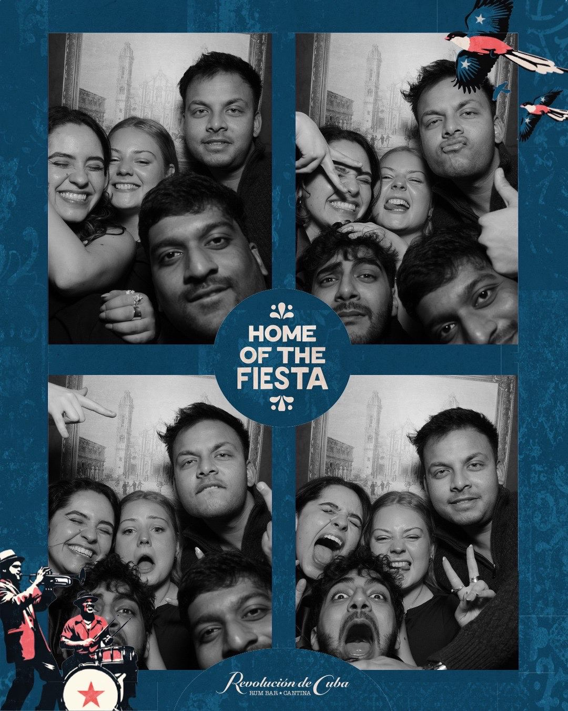
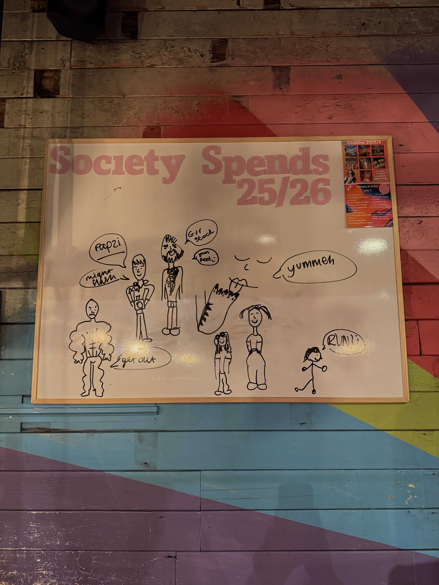
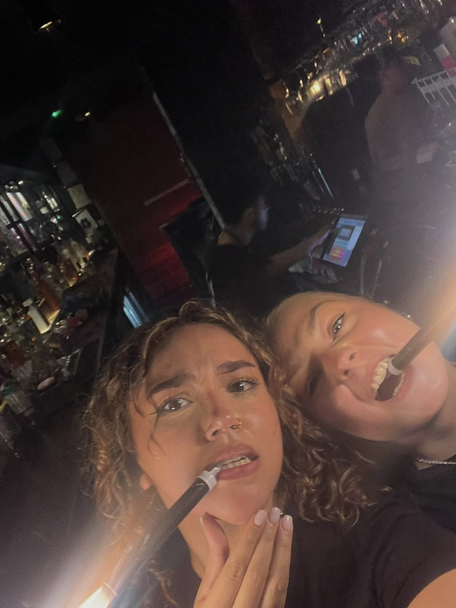
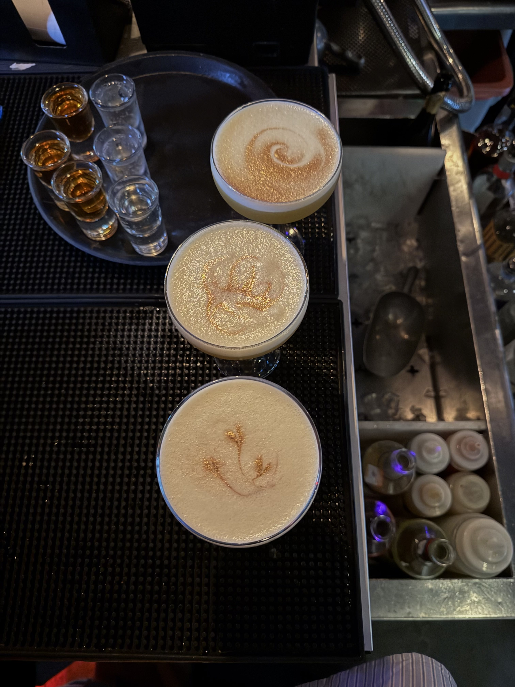
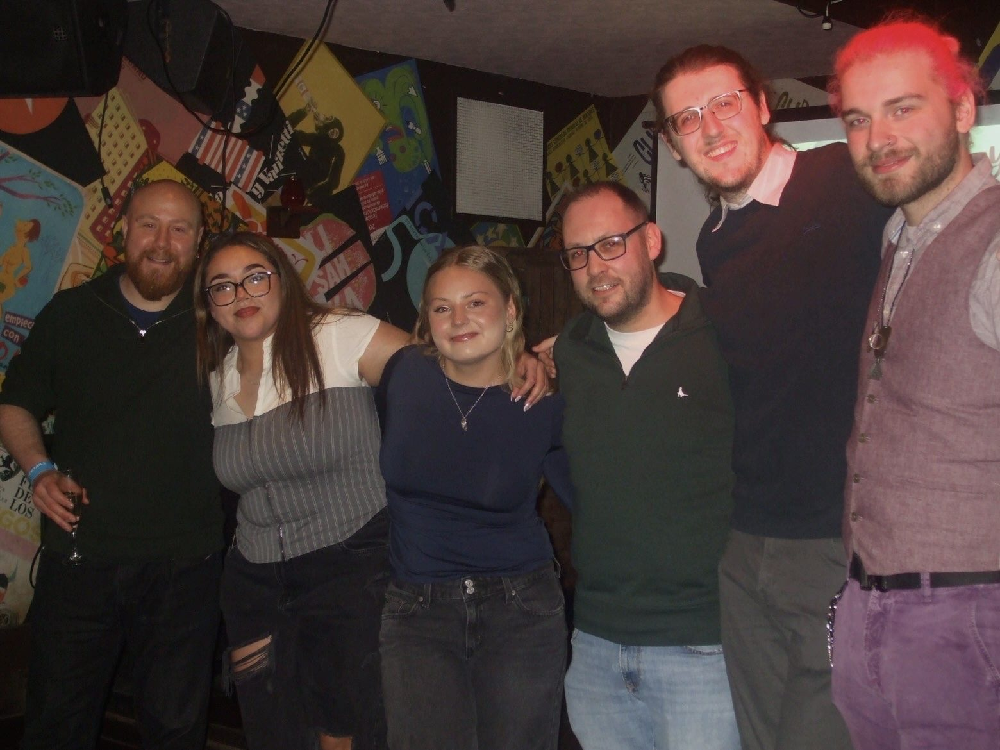
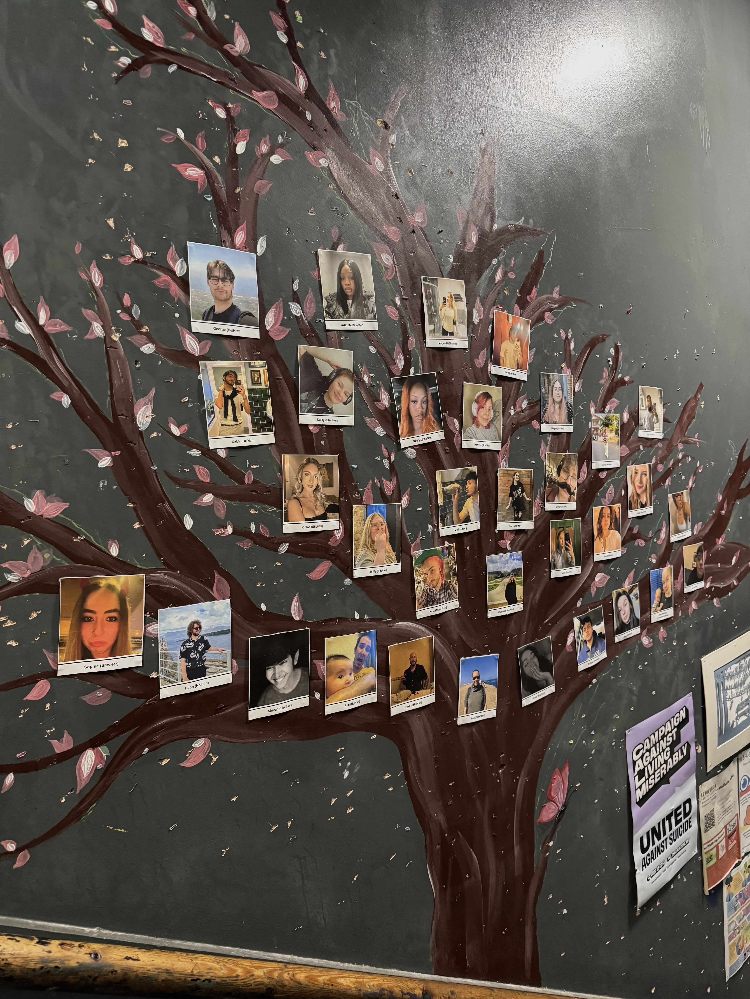
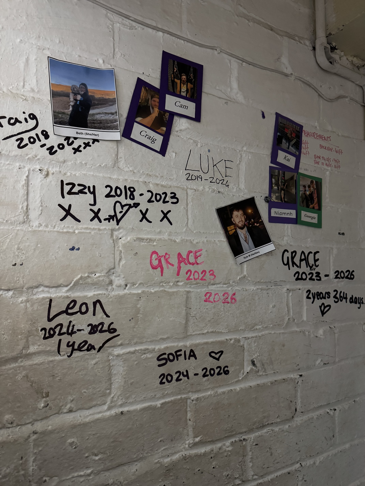
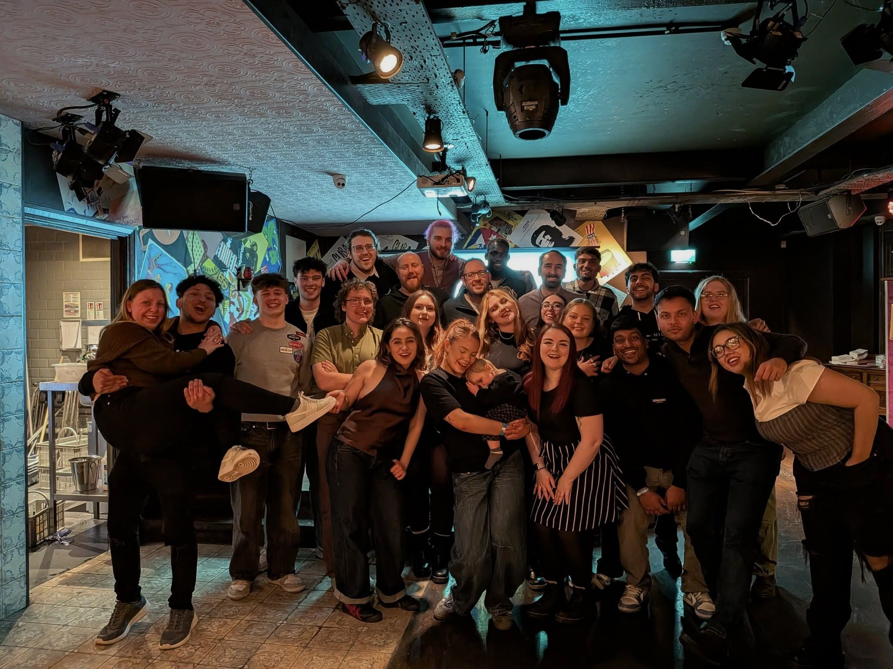

Following recent changes at **The Revel Collective**, after almost two years, myself and many others have unfortunately been made redundant.

While this isn’t how I envisioned my time at **Revolution Huddersfield** to end, I’m incredibly grateful for the all opportunities, experiences, and support I received during my time there. I’m genuinely proud of how much I grew (both personally and professionally) throughout this journey.

Starting off as a Bar Staff and being promoted to Team Leader after my first year of working there showed me how much I'm capable of. During my time in this role I developed many relevant skills including leadership, time-management, effective communication, and team-working. I led busy Friday and Saturday night closing shifts acting as duty manager, handling end-of-day cash up and administration, handling customer issues, and maintaining high service standards. I also delegated tasks across the team ensuring efficiency during peak service periods. 

However, above all else, the most valuable thing I take with me are all the unforgettable memories and relationships I’ve built with all these amazing people. The team at Revolution Huddersfield was truly a family, and one I’m incredibly proud to have been a part of.

